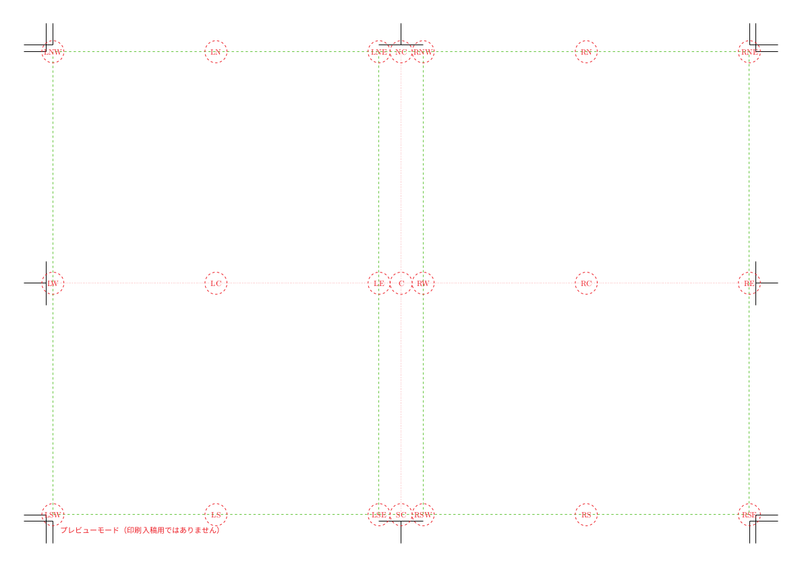

# review-covermaker

一般的な書籍製本に使われる「くるみ製本」用の表紙 PDF を作成します。

- Re:VIEW のライブラリおよび TeXLive 2018 以上の環境を利用します。
- デフォルトでは「Noto CJK OTC」フォントセットを使用します（TeX システムに十分にフォントがインストールされていれば、プリセットマップの範囲で選択可能です）。
- 設定は YAML 形式です。Re:VIEW のプロジェクトで使用していれば、その config.yml に表紙用のエントリを追加するだけで済みます。
- 表1 (表紙)、背、表4 (裏表紙) が 1 つになった PDF を作成します。電子版 PDF のために表1 のみを抽出することも可能です。
- 背の幅 (束) は数値で指定することも、紙厚×ページ数で指定することもできます。
- 現時点では左綴じ専用です。


## 準備
- Docker を利用できるのであれば、本リポジトリ内に収録している Dockerfile を使って実行環境を構築できます。

ネイティブの環境で使う場合:

- Re:VIEW gem および TeXLive 2018 以上がインストールされており、uplatex と dvipdfmx のコマンドにパスが通っているようにしてください (YAML 設定で絶対パスを指定することも可能です)。
- 2019年5月時点の Docker vvakame/review の TeXLive は 2016 のため動作しません。

## コマンド
```
review-covermaker [オプション] YAMLファイル [PDFファイル]
```

### オプション
- `--onlyone`: 表1 (表紙) の PDF のみを作成します。
- `--debug`: ビルドフォルダをカレントフォルダ下に作り、その中でビルドして消さずにおきます (*bookname*-cover-pdf フォルダ)。エラーが発生したときの解析利用を目的としています。
- `--preview`: 表1・背・表4 の範囲枠を示します。
- `--previewmore`: 枠に加えて、要素配置のポインタの名前を示します。
- `--help`: コマンドのヘルプを表示します。

「PDFファイル」を省略した場合、YAMLファイルの情報に従って「*bookname*-cover.pdf」というファイルが作成されます。

### 実行例
各種の config YAML ファイルを用意しているので、まずはいろいろ試してみるとよいでしょう。

```
# B5のサンプル
$ review-covermaker config.yml
# B5のサンプルの表1を book-cover-h1.pdf という名前で保存
$ review-covermaker --onlyone config.yml book-cover-h1.pdf
# B5サンプルに枠などの情報を付ける
$ review-covermaker --previewmore config.yml
# A5のサンプル
$ review-covermaker config-a5.yml
# 小塚フォントマップを使用
$ review-covermaker config-kozuka.yml
# Windows10のYuフォントマップを使用
$ review-covermaker config-yu-win10.yml
# 画像ではなく塗り潰しを使用
$ review-covermaker config-b5-fill.yml
# 背に画像を配置
$ review-covermaker config-b5-spineimage.yml
```

## 設定
設定は YAML 形式です。Re:VIEW のプロジェクトの config.yml に追加することを想定しています。

```
bookname: book
booktitle: "Re:VIEWの表紙"

covermaker:
  …
```

bookname、booktitle は Re:VIEW の通常のプロジェクトと同じく、ファイル名のベースとなる名前 (bookname) と、書名 (booktitle) を表します。booktitle は `{name: "Re:VIEWの表紙", file-as: "reviewノヒョウシ"}` のような振り仮名付き指定方式でもかまいません（review-covermaker は振り仮名を無視しますが）。

covermaker の下位に、インデント (通常2文字スペース) して表紙の固有の設定を加えていきます。以下の説明はいずれも covermaker の下位の設定であることに注意してください。

### 基本設定
- `paper`: 製本後の紙サイズを b5 または a5 で指定します。省略時は b5 です。なお、この b5 は「JIS B5 正寸」です。
- `tombopaper`: トンボ付きの紙サイズを a3 または b4 で指定します。省略時は a3 です。なお、b4 を指定できるのは paper が a5 のときのみです。
- `bleedmargin`: 塗り足し領域の幅を mm 単位で指定します。省略時は 3 です。妥当な値は印刷所に確認してください。

### 背幅
背幅は、明示指定するか、紙の厚さとページ数から内部で計算させるかのどちらかを選択します。

- `spine`: 背幅を mm 単位で指定します。
- `paperthickness`: 紙厚を mm 単位で指定します。省略時は 0.063 です。
- `pages`: ページ数を指定します。本文のページ数にたとえば4ページぶん加えるなど印刷所によってルールがありますので、紙厚や計算方法は印刷所に確認してください。

spine と pages の両方を指定するとエラーになります。何も指定しないと背幅 0mm になります。

### ベースの背景
- 背景とする画像ファイルまたは塗り潰し色を指定します。両方を指定することもでき、その場合は塗り潰した上に画像ファイルを置きます。
- 画像ファイルは、おおむね任意の画像ファイルを指定できますが、印刷入稿用途としては、カラーモデルに CMYK を使用した PDF ファイルまたは Adobe Illustrator ファイル (の PDF 互換保存モードによって内包される PDF ファイル) を推奨します。
- 画像は実寸とし、表1は上・下・右に、背は上・下に、表4は上・下・左に、それぞれ所定の塗り足し幅 (通常 3mm) を加えた形で作ることを推奨します。
- 背景は、背→表1→表4の順に描画されます。

設定は以下のとおりです。

- `frontcoverimage`: 表1 (表紙) の設定項目です。この下位に画像についての設定を行います。画像は表1領域の中央合わせで配置されます。
  - `file`: 画像のファイル名パスを指定します。
  - `xoffset`: 左右方向のオフセット値を mm 単位で指定します。省略時は 0 です。
  - `yoffset`: 上下方向のオフセット値を mm 単位で指定します。省略時は 0 です。
  - `option`: TeX の includegraphics マクロに渡す固有のパラメータを指定します。省略時は空です。
- `backcoverimage`: 表4 (裏表紙) の設定項目です。下位の設定は frontcoverimage と同じです。画像は表4領域の中央合わせで配置されます。
- `spineimage`: 背の設定項目です。下位の設定は frontcoverimage と同じです。画像は背領域の中央合わせで配置されます。

たとえば以下のようになります。

```
covermaker:
  …
  frontcoverimage:
    file: sample-images/b5-sample-h1.ai
  spineimage:
    file: sample-images/b5-spine.ai
  backcoverimage:
    file: sample-images/b5-sample-h4.ai
```

単色で塗り潰すこともできます。

- `frontcoverfill`: `[C, M, Y, K]` の値配列 (C, M, Y, K はそれぞれ 0.0〜1.0 の数値) で CMYK カラーモデルに基づく色を指定し、表1 を塗り潰します。
- `backoverfill`: `[C, M, Y, K]` の値配列の CMYK カラーで 表4 を塗り潰します。
- `spinefill`: `[C, M, Y, K]` の値配列の CMYK カラーで 背 を塗り潰します。

### 文字および画像
紙面上には、ここではポインタと呼ぶ参照点があります。「ポインタに文字や画像を置く」ことで紙面を作っていきます。以下のようなポインタが用意されています (記号はおおむね方位を表していることに注目してください)。

- `LNW`: 表4 左上
- `LN`: 表4 上中央
- `LNE`: 表4 右上
- `LW`: 表4 左
- `LC`: 表4 中央
- `LE`: 表4 右
- `LSW`: 表4 左下
- `LS`: 表4 下中央
- `LSE`: 表4 右下
- `NC`: 背 上中央
- `C`: 背 中央
- `SC`: 背 下中央
- `RNW`: 表1 左上
- `RN`: 表1 上中央
- `RNE`: 表1 右上
- `RW`: 表1 左
- `RC`: 表1 中央
- `RE`: 表1 右
- `RSW`: 表1 左下
- `RS`: 表1 下中央
- `RSE`: 表1 右下



ポインタ名の下位に文字列や画像を指定します。

文字列の指定は以下のとおりです。

- `string`: 掲載する文字列を配列 (`["文字列1", "文字列2", ...]`) で指定します。配列に複数の要素があると、それぞれ改行されます。ここに指定する文字列には TeX マクロや Re:VIEW 命令などは指定できません。単にエスケープされた状態で表示されることになります。
- `fontsize`: 文字のサイズを pt 単位で指定します。省略時は 20 です。
- `lineskip`: 行間の比率を指定します。fontsize ×比率 のぶんの空きとなります。省略時は 0.5 です。
- `vertical`: 縦書きにします。省略時は null (横書きのままにする) です。縦書きの場合、配列要素を複数にしても文字列は改行されず、つながった状態になります。
- `xoffset`: 左右方向のオフセット値を mm 単位で指定します。省略時は 0 です。
- `yoffset`: 上下方向のオフセット値を mm 単位で指定します。省略時は 0 です。
- `align`: 改行で複数行にわたる場合、揃える位置を left, center, right から指定します。省略時は center です。
- `color`: 文字の色を固定値の black か white、または `[C, M, Y, K]` の値配列 (C, M, Y, K はそれぞれ 0.0〜1.0 の数値) で CMYK カラーモデルに基づく色を指定します。省略時は black です。
- `font`: 書体の名前を mincho-light, mincho-medium, mincho-bold, gothic-medium,  gothic-bold, gothic-exbold, maru-medium から指定します (それぞれ細い明朝、普通の明朝、太い明朝、普通のゴシック、太いゴシック、極太ゴシック、丸文字)。省略時は mincho-medium です。
- `norelfont`: 欧文や記号の箇所に、和文フォントの従属欧文書体を使うのではなく、TeX の欧文フォント設定を使います。省略時は null (和文フォントを使う) です。※欧文フォントを任意に指定するのは簡易には済まないため、カスタムするには結局 rawstring などを使う必要があるでしょう。また、gothic-exbold に対して妥当な欧文フォントが適用されないため、極太ゴシックのはずが細い文字になります。
- `rawstring`: TeX マクロを含めた生の文字列を指定します。配列ではなく、単一文字列 (`"〜"`) で定義します。数式など任意の入力ができますが、少しでも不正なものを入れると不明瞭なエラーを導くことになります。また、font、fontsize、lineskip、vertical、color、norelfont の指定は無視されます。string と同時に定義することはできず、定義するとエラーになります。

画像の指定は以下のとおりです。

- `image`: 画像を配置します。下位の設定項目は背景のときと同じです。
  - `file`: 画像のファイル名パスを指定します。
  - `xoffset`: 左右方向のオフセット値を mm 単位で指定します。省略時は 0 です。
  - `yoffset`: 上下方向のオフセット値を mm 単位で指定します。省略時は 0 です。
  - `option`: TeX の includegraphics マクロに渡す固有のパラメータを指定します。省略時は空です。

例を示します。

- 表4の下中央のポインタ (LS) に、文字列「当然画像も置ける！」を太字ゴシック、 上に 10mm オフセットして配置します。画像 sample-images/noto.pdf を、上に 5mm オフセットして、幅 120mm に拡縮し、画像のボックス計算には artbox 情報を使って配置します。

```
covermaker:
  …
  LS:
    string: ["当然画像も置ける！"]
    font: gothic-bold
    yoffset: -10
    image:
      file: sample-images/noto.pdf
      yoffset: 5
      option: "width=120mm,pagebox=artbox"
```

まずすべての画像が先に配置され、それから文字列がその上に配置されます。

### フォントセット
本ツールは、書体名と実フォントとの紐付けには pxchfon という TeX パッケージを使っています。紐付けはマップファイルとしてまとめられており、そのマップファイルを変更できます。

- `pxchfonmap`: プリセットからのフォントマップを指定します。省略時は noto-otc

noto-otc は、Noto CJK OTC を使うプリセットマップです。

利用可能なプリセットマップについては下記のドキュメントを参照してください（特に「多ウェイト用の設定」）。

- https://github.com/zr-tex8r/PXchfon/blob/master/pxchfon.pdf

当然ながら、プリセットマップの指定だけでなく、実際のフォントを購入・購読して入手し、TeX のシステムから見えるようにインストールする必要があります。

### その他の設定
通常指定することはないでしょうが、以下のような設定項目を用意しています。

- `preview`: 枠を表示します。省略時は null (表示しない) です。
- `previewmore`: ポインタを表示します。省略時は null (表示しない) です。
- `onlyone`: 表1のみ出力します。省略時は null (背・表4も出力) です。
- `noshowinfo`: 上部にファイル情報および日付を表示するのを止めます。省略時は null (表示する) です。
- `texcommand`: TeX コンパイラを指定します。省略時は uplatex。本ツールは upLaTeX のみで、LuaLaTeX などの他コンパイラには対応していません。絶対パスで指定したいときを想定しています。
- `texoptions`: TeX コンパイラのコマンドオプションを指定します。省略時は `-interaction=nonstopmode -file-line-error` です。
- `dvicommand`: DVIware を指定します。省略時は dvipdfmx。絶対パスで指定したいときを想定しています。
- `dvioptions`: DVIware のコマンドオプションを指定します。省略時は `-d 5 -z 9` です。
- `oldjis`: JIS2004 字形ではなく、旧 JIS 字形を使います。省略時は null (JIS2004使用) です。

## 入稿
- 印刷所の入稿仕様をよく読み、仕様に沿っていることを確認し、不明な場合は印刷所に問い合わせるなどしてください。
- 通常、入稿 PDF 内でのカラーモデルは CMYK のみで構成されていることが前提となります。本ツールで生成する文字部分および塗り潰しの色については CMYK であることを強制していますが、貼り込まれた画像が CMYK かどうかの判断はしていません。
- PDF/X-1a や PDF/X-4 といった入稿標準形式への変換対応は本ツールでは提供していません。これらの標準形式対応が必須の場合、Adobe Acrobat や pdfToolbox などの別のツールを使用して適宜変換する必要があります。

## 参照
- Re:VIEW: https://reviewml.org/ja/
- Noto CJK: https://www.google.com/get/noto/help/cjk/

## ライセンス
Copyright (c) 2019 Kenshi Muto

MIT License (LICENSE ファイルをご覧ください)
